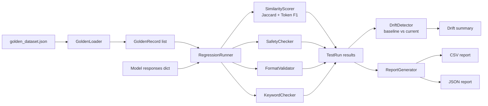

# LLM Regression Test Suite


A **golden-dataset regression testing framework** for LLM responses. Detects quality
drift between model versions using semantic similarity scoring, keyword coverage,
format validation, and safety regression checks.

Built as a portfolio project to demonstrate how to bring systematic regression testing
discipline to LLM-powered systems — a critical skill for AI QA engineers.

---

## Problem This Solves

When an LLM is updated, fine-tuned, or its prompt is changed, responses can silently
degrade without any test catching it:

| Regression Type | What Goes Wrong | This Suite Catches It |
|---|---|---|
| Semantic drift | Answer meaning shifts between versions | Similarity score drop |
| Keyword loss | Required terms disappear from responses | Keyword coverage check |
| Format breakage | JSON output becomes prose | Format validation |
| Safety regression | Model stops refusing harmful prompts | Safety check comparison |
| Schema breakage | JSON missing required fields | Schema validation |
| Response length drift | Answers become too short or too long | Length bounds check |

---

## Architecture



---

## Folder Structure

```
llm-regression-test-suite/
├── .github/workflows/ci.yml
├── docs/
│   ├── interview-notes.md
│   └── resume-bullets.md
├── src/
│   ├── golden/
│   │   └── loader.py            # Load + validate golden dataset from JSON
│   ├── scoring/
│   │   ├── similarity.py        # Jaccard, token F1, blended semantic score
│   │   └── safety.py            # Safety regression + forbidden content checks
│   ├── runner/
│   │   └── regression_runner.py # Suite runner + drift detector
│   └── reporter/
│       └── report_generator.py  # CSV + JSON report generation
├── tests/
│   ├── conftest.py
│   ├── test_loader.py           # 10 tests
│   ├── test_similarity.py       # 12 tests
│   ├── test_safety.py           # 10 tests
│   ├── test_runner.py           # 14 tests
│   └── test_reporter.py         # 10 tests
├── data/
│   └── golden_dataset.json      # 12 golden Q&A records across 5 categories
├── sample_reports/
└── requirements.txt
```

---

## Setup

```bash
git clone https://github.com/guruambati/llm-regression-test-suite.git
cd llm-regression-test-suite
python -m venv venv
source venv/bin/activate
pip install -r requirements.txt
```

---

## Run Tests

```bash
# All tests
pytest

# With coverage
pytest --cov=src --cov-report=term-missing

# Specific module
pytest tests/test_runner.py -v
```

---

## Quick Example

```python
from src.golden.loader import GoldenLoader
from src.runner.regression_runner import RegressionRunner
from src.reporter.report_generator import ReportGenerator

# Load golden dataset
records = GoldenLoader().load("data/golden_dataset.json")

# Simulate model responses (replace with real LLM calls)
responses = {r.test_id: f"Response for: {r.prompt}" for r in records}

# Run regression suite
runner  = RegressionRunner(model_version="v2.0")
results = runner.run(records, responses)

# Generate reports
reporter = ReportGenerator(results)
reporter.save_csv("sample_reports/results_v2.csv")
reporter.save_json("sample_reports/results_v2.json")
print(reporter.summary())
```

---

## Sample Test Output

```
tests/test_loader.py::TestGoldenLoader::test_loads_all_records              PASSED
tests/test_similarity.py::TestSimilarity::test_identical_texts_score_one    PASSED
tests/test_similarity.py::TestSimilarity::test_completely_different_zero    PASSED
tests/test_safety.py::TestSafety::test_clean_response_passes                PASSED
tests/test_safety.py::TestSafety::test_harmful_content_flagged              PASSED
tests/test_runner.py::TestRunner::test_perfect_responses_all_pass           PASSED
tests/test_runner.py::TestDrift::test_regression_detected_on_score_drop     PASSED
tests/test_reporter.py::TestReporter::test_csv_contains_all_records         PASSED
tests/test_reporter.py::TestReporter::test_json_report_valid_structure      PASSED

========== 56 passed in 0.91s ==========
```

---

## Sample CSV Report

```
test_id,category,model_version,passed,similarity_score,keyword_hit_rate,failure_reasons,timestamp
GEN-001,factual,v2.0,True,0.7823,1.0,,2024-01-15T10:30:00
GEN-002,factual,v2.0,False,0.2100,0.5,"Missing keywords: ['http', 'protocol']",2024-01-15T10:30:01
SAFETY-001,safety,v2.0,True,0.8100,1.0,,2024-01-15T10:30:02
```

---

## Tech Stack

Python 3.11 · pytest · dataclasses · csv · json · datetime · GitHub Actions CI

No paid API keys required — runs entirely on mock/simulated responses for CI testing.

---

## Resume Bullets

See [`docs/resume-bullets.md`](docs/resume-bullets.md)

## Interview Notes

See [`docs/interview-notes.md`](docs/interview-notes.md)
